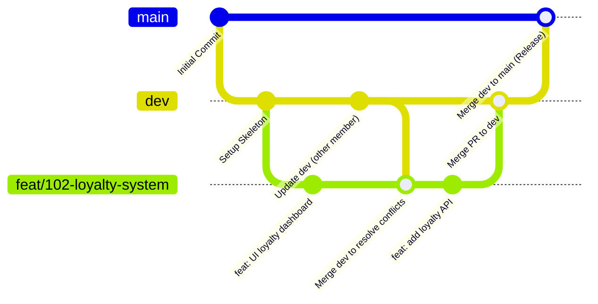

# Quy trình chuẩn cộng tác Git & Hoàn thành Issue (GitHub) - Dự án ATPP

Tài liệu này hướng dẫn chi tiết quy trình từ lúc bắt đầu nhận Issue cho đến khi hoàn thành và tích hợp mã nguồn vào nhánh phát triển (`dev`) trước khi đưa lên nhánh chính (`main`) của dự án **ATPP (AI-Assisted Traditional Costume & Photography Marketplace Platform)**.

---

## Sơ đồ Quy trình (Git Workflow Overview)



---

## Chi tiết các bước thực hiện

### Bước 1: Khởi tạo và Thiết lập Local Environment

Nếu đây là lần đầu tiên bạn tham gia dự án hoặc chuyển máy làm việc, hãy tải dự án về và cài đặt môi trường.

1. **Clone mã nguồn từ GitHub:**
   ```bash
   git clone https://github.com/VibeHue365/ATPP.git
   cd Vibehue
   ```

2. **Cài đặt dependencies cho từng module:**
   Dự án ATPP bao gồm 3 phân hệ công nghệ chính:
   *   **Frontend (ReactJS):**
       ```bash
       cd frontend # hoặc apps/frontend tùy cấu trúc thư mục thực tế
       npm install
       ```
   *   **Backend (NestJS):**
       ```bash
       cd backend # hoặc apps/backend
       npm install
       ```
   *   **AI Service (Python FastAPI):**
       ```bash
       cd ai-service # hoặc apps/ai-service
       python -m venv venv
       source venv/bin/activate  # Trên Windows dùng: venv\Scripts\activate
       pip install -r requirements.txt
       ```


### Bước 2: Đồng bộ hóa trước khi làm việc

Trước khi tạo bất kỳ tính năng mới nào, bạn luôn phải đảm bảo code trên máy của mình đồng bộ với nhánh phát triển (`dev`) mới nhất trên remote server.

```bash
# 1. Chuyển về nhánh dev
git checkout dev

# 2. Lấy code mới nhất về máy
git pull origin dev
```

---

### Bước 3: Tạo nhánh Feature cho Issue được giao

Quy tắc đặt tên nhánh:
> **`<loại_nhánh>/<mã_số_issue>-<mô_tả_ngắn>`**

* **Loại nhánh:**
  * `feat/` : Tính năng mới (ví dụ: `feat/102-loyalty-system`).
  * `fix/` : Sửa lỗi (ví dụ: `fix/204-cancellation-policy-error`).
  * `test/` : Viết test (ví dụ: `test/105-booking-unit-test`).
  * `docs/` : Cập nhật tài liệu thiết kế DB, API.

* **Ví dụ tạo nhánh mới từ nhánh `dev`:**
  Đầu tiên, hãy chắc chắn bạn đang ở nhánh `dev` và nhánh này đã được cập nhật mới nhất, sau đó chạy lệnh tạo nhánh mới:
  ```bash
  git checkout dev
  git checkout -b feat/102-loyalty-system
  ```

---

### Bước 4: Phát triển & Commit mã nguồn

1. **Tiến hành viết code:** Thực hiện nhiệm vụ được giao trong Issue.
2. **Kiểm tra trạng thái file:**
   ```bash
   git status
   ```
3. **Thêm file thay đổi vào staging area:**
   ```bash
   git add <tên_file_hoặc_thư_mục>
   # Hoặc thêm tất cả
   git add .
   ```
4. **Commit kèm thông điệp chuẩn (Conventional Commits) theo đúng Module:**
   Định dạng: `type(scope): description`
   * **Scope gợi ý:** `frontend`, `backend`, `ai`, `database`, `docs`.
   * **Ví dụ:**
     ```bash
     git commit -m "feat(frontend): design loyalty point exchange UI component"
     git commit -m "feat(backend): implement point deduction and coupon listing logic"
     ```
   * *Mẹo:* Chia nhỏ các commit theo tiến độ nhỏ để dễ dàng hoàn tác (revert) khi phát sinh lỗi.

---

### Bước 5: Cập nhật code mới nhất từ `dev` để tránh Conflict

Trong lúc bạn đang code, các thành viên khác có thể đã merge code của họ vào `dev`. Hãy chủ động gộp code từ `dev` vào nhánh của bạn trước khi đẩy lên GitHub:

```bash
# 1. Lưu tạm công việc đang làm dở (nếu chưa commit)
git stash

# 2. Cập nhật dev ở local
git checkout dev
git pull origin dev

# 3. Quay lại nhánh feature của bạn và phục hồi code chưa commit (nếu có)
git checkout feat/102-loyalty-system
git stash pop 

# 4. Merge nhánh dev vào nhánh của bạn
git merge dev
```
*Mẹo rút gọn: Bạn cũng có thể dùng `git fetch origin` và `git merge origin/dev` ngay trên nhánh feature của mình để tránh phải checkout qua lại.*

*Nếu xảy ra **conflict (xung đột)**: Hãy mở công cụ soạn thảo (VS Code) để so sánh và giải quyết thủ công các dòng bị xung đột, sau đó chạy `git add .` và `git commit` để hoàn thành việc giải quyết conflict.*

---

### Bước 6: Đẩy nhánh lên Remote GitHub

Đẩy nhánh feature của bạn lên GitHub để chuẩn bị tạo Pull Request:

```bash
git push -u origin feat/102-loyalty-system
```
*(Từ các lần push sau trên nhánh này, bạn chỉ cần gõ nhanh `git push`).*

---

### Bước 7: Tạo Pull Request (PR) & Liên kết với Issue

1. Truy cập vào trang GitHub của dự án [https://github.com/VibeHue365/ATPP.git](https://github.com/VibeHue365/ATPP).
2. Bạn sẽ thấy một banner màu vàng gợi ý: **"Compare & pull request"**, hãy nhấn vào đó.
3. **Điền thông tin PR:**
   * **Chọn nhánh đích:** Chọn base branch là **`dev`** (không chọn `main`).
   * **Tiêu đề:** Tương tự tên commit, ví dụ: `feat: Implement Customer Loyalty Program (#102)`.
   * **Mô tả:** Mô tả chi tiết những gì bạn đã thực hiện, đính kèm ảnh chụp màn hình/video demo giao diện (nếu có thay đổi UI).
   * **Liên kết tự động đóng Issue:** Trong phần mô tả PR, viết từ khóa đặc biệt để GitHub tự động đóng Issue tương ứng khi PR được duyệt và merge:
     ```text
     Closes #102
     ```
4. Gán **Reviewers** (Tech Lead hoặc các thành viên chịu trách nhiệm kiểm tra chéo code của bạn).

---

### Bước 8: Đánh giá mã nguồn (Code Review) & Sửa đổi

* Reviewer sẽ vào đọc code, chạy thử và để lại các nhận xét góp ý.
* Nếu có yêu cầu chỉnh sửa (Request Changes):
  * Bạn tiến hành chỉnh sửa trực tiếp trên máy của mình (vẫn ở nhánh `feat/102-loyalty-system`).
  * Thực hiện commit và push lên như bình thường:
    ```bash
    git add .
    git commit -m "fix(backend): fix point calculation logic based on review suggestions"
    git push
    ```
  * Pull Request trên GitHub sẽ **tự động cập nhật** các commit mới này, bạn không cần phải tạo PR mới.

---

### Bước 9: Trộn nhánh (Merge PR) và Dọn dẹp

1. Sau khi PR được **Approved** (Chấp thuận) và vượt qua các bài kiểm tra tự động:
   * Nhấn nút **Squash and merge** trên GitHub (gộp toàn bộ các commit nhỏ của bạn thành 1 commit duy nhất trên nhánh **`dev`** để lịch sử Git sạch sẽ).
2. Khi PR được merge:
   * GitHub sẽ tự động chuyển trạng thái của **Issue #102** sang **Closed**.
3. **Dọn dẹp ở máy cá nhân (Local):**
   ```bash
   # Chuyển về dev
   git checkout dev
   # Cập nhật dev mới nhất (đã chứa code của bạn vừa được merge)
   git pull origin dev
   # Xóa nhánh phụ đã làm xong để tránh rác máy
   git branch -d feat/102-loyalty-system
   ```

---

### Bước 10: Tích hợp từ `dev` lên `main` (Release Định Kỳ)

Khi các tính năng trên nhánh `dev` đã hoạt động ổn định và được kiểm thử chất lượng đầy đủ:
1. Tạo một Pull Request từ nhánh `dev` sang nhánh `main` trên GitHub (tiêu đề ví dụ: `release: v1.0.0` hoặc `merge dev into main`).
2. Tech Lead hoặc người phụ trách dự án duyệt và thực hiện merge PR này vào `main`.
3. Đồng bộ lại ở máy cá nhân:
   ```bash
   git checkout main
   git pull origin main
   git checkout dev
   git merge main
   ```

---

> [!IMPORTANT]
> **Quy tắc vàng của dự án:**
> 1. Không bao giờ commit hay push trực tiếp lên nhánh `main` và `dev`. Cả hai nhánh này phải luôn được bảo vệ và chỉ thay đổi thông qua Pull Request (PR).
> 2. Luôn chạy `git pull origin dev` để cập nhật code mới trước khi tạo nhánh mới hoặc trước khi push/merge PR.
> 3. Kiểm tra kỹ để đảm bảo code chạy thử local không bị lỗi biên dịch (build error) hoặc lỗi cú pháp trước khi push.
