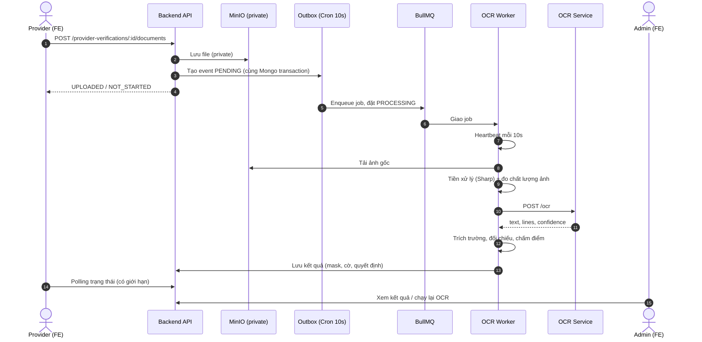

# Thiết kế hệ thống OCR xác minh Provider – VibeHue

> Tài liệu thiết kế cho module OCR trong quy trình đăng ký Provider (Customer → Provider). Mỗi hạng mục được trình bày theo mẫu **Hiện trạng → Điểm yếu → Giải pháp**, để điểm yếu và cách khắc phục luôn đi cùng nhau.

---

## 1. Mục tiêu và phạm vi

### 1.1. Mục tiêu

- Tự động đọc giấy tờ do Provider tải lên (CCCD mặt trước/sau, giấy phép kinh doanh, đăng ký thuế, chứng chỉ chuyên môn) để **giảm công thẩm định thủ công** của Admin.
- **Đối chiếu (cross-check)** thông tin người dùng đã khai báo ở Bước 1 với thông tin đọc được từ giấy tờ ở Bước 3; auto-fill chỉ là chức năng tùy chọn, do người dùng chủ động bấm (xem mục 1.4).
- Phát hiện sớm hồ sơ có dấu hiệu bất thường (ảnh kém chất lượng, tên không khớp) để yêu cầu bổ sung.

### 1.2. Nguyên tắc thiết kế cốt lõi

| # | Nguyên tắc | Ý nghĩa |
|---|---|---|
| 1 | **OCR hỗ trợ, không quyết định** | OCR chỉ đưa ra tín hiệu và cờ cảnh báo; quyết định cuối cùng thuộc về Admin. |
| 2 | **Bất đồng bộ, không chặn người dùng** | Upload trả về ngay, OCR chạy nền qua Outbox + BullMQ. |
| 3 | **Không làm rò rỉ dữ liệu định danh** | Số CCCD chỉ lưu dạng che (mask) và băm HMAC-SHA256; file nằm trong bucket private. |
| 4 | **Có thể thay thế engine** | OCR engine nằm sau một interface, đổi Tesseract/PaddleOCR/Vision API bằng cấu hình. |
| 5 | **Đo được chất lượng** | Mọi cải tiến phải chứng minh bằng số liệu trên bộ ảnh mẫu. |

### 1.3. Ngoài phạm vi

- Xác thực sinh trắc học (so khớp khuôn mặt, liveness).
- Tra cứu đối chiếu với cơ sở dữ liệu quốc gia.

### 1.4. Vai trò của OCR trong luồng đăng ký 5 bước

**Hiện trạng.** Trang `BecomeProviderPage.tsx` đi tuần tự: Bước 0 (chọn năng lực) → Bước 1 (thông tin cơ sở: `ownerName`, phone, email, địa chỉ, tỉnh/thành...) → Bước 2 (đồng ý điều khoản) → **Bước 3 (tải giấy tờ, OCR chạy ở đây)** → Bước 4 (kiểm tra và gửi duyệt).

**Điểm yếu (xung đột UX).** Khi OCR chạy, người dùng đã gõ tay tên và địa chỉ ở Bước 1. Nếu OCR đọc ra giá trị khác thì không rõ nên ghi đè ngược, chỉ hiển thị, hay chỉ dùng để đối chiếu. Thiết kế "auto-fill" ban đầu bỏ qua xung đột này.

**Giải pháp (quyết định thiết kế).**

| Câu hỏi | Quyết định |
|---|---|
| OCR là công cụ gì trong giai đoạn này? | **Đối chiếu xác thực (cross-check)** là vai trò chính. Dữ liệu khai báo ở Bước 1 là nguồn gốc; OCR **không bao giờ tự ghi đè**. |
| Auto-fill thì sao? | Chỉ là tùy chọn: nút **"Áp dụng thông tin từ CCCD"** ở Bước 3, mở bảng so sánh *khai báo ↔ đọc được*, người dùng tích chọn từng trường rồi mới ghi vào form Bước 1. |
| Trường nào được áp dụng? | Chỉ trường "đáng tin" (họ tên, ngày sinh, ngày hết hạn, số giấy tờ). Địa chỉ, quê quán là *best-effort*: chỉ hiện gợi ý, không dùng để chặn hồ sơ. |
| Có đảo Bước 3 lên trước Bước 1 không? | **Không**, ở giai đoạn này. Cơ chế đối chiếu tên cần `ownerName` từ Bước 1 làm đầu vào; đảo thứ tự sẽ phải thiết kế lại luồng và trạng thái hồ sơ. Ghi vào hướng phát triển. |
| Ghi nhận nguồn dữ liệu | Trường được áp dụng từ OCR đánh dấu `source: 'OCR_APPLIED'` để Admin và phần đánh giá phân biệt được với dữ liệu gõ tay. |

---

## 2. Kiến trúc tổng thể

### 2.1. Thành phần

| Thành phần | Công nghệ | Vai trò |
|---|---|---|
| Frontend Provider | React (`BecomeProviderPage.tsx`) | Upload, theo dõi trạng thái, hiển thị và xác nhận kết quả |
| Backend API | NestJS (`ProviderVerificationsController/Service`) | Nhận file, kiểm tra, lưu, tạo Outbox event |
| Lưu trữ file | MinIO (bucket private `provider`) | Lưu ảnh gốc theo phiên bản |
| Outbox | MongoDB + Cron 10s | Đảm bảo không mất sự kiện giữa DB và queue |
| Hàng đợi | BullMQ (Redis) | Điều phối job, retry theo exponential backoff |
| Worker | `ProviderDocumentOcrService` | Tiền xử lý ảnh (Sharp), gọi OCR, đối chiếu nghiệp vụ |
| OCR Service | FastAPI + Tesseract | Trả về văn bản và độ tin cậy |
| Recovery | Cron 30s | Giải cứu job treo dựa trên heartbeat |
| Admin UI | React (`VerificationWorkspace.tsx`) | Thẩm định, xem cờ, chạy lại OCR |

### 2.2. Luồng end-to-end



---

## 3. Thiết kế chi tiết từng thành phần

### 3.1. Upload và lưu trữ

**Hiện trạng.** Multer giới hạn 5MB, kiểm tra magic bytes, băm SHA-256, lưu key `<verificationId>/<documentType>/v<versionNo>.<ext>`, tạo version mới trong MongoDB với `uploadStatus: UPLOADED`, `ocrStatus: NOT_STARTED`.

**Điểm yếu.**
- Ảnh chụp từ điện thoại có thể lớn hơn 5MB và bị từ chối, khiến người dùng phải tự nén.
- Chưa có kiểm tra chất lượng ngay từ phía client nên lỗi chỉ được phát hiện sau khi đã xử lý xong.

**Giải pháp.**
- FE nén và resize ảnh (cạnh dài tối đa khoảng 2000px, JPEG chất lượng 0.85) trước khi gửi.
- FE cảnh báo sớm: ảnh quá nhỏ (cạnh ngắn dưới 600px) thì nhắc chụp lại ngay, chưa cần gọi backend.
- Backend giữ nguyên các kiểm tra hiện có (magic bytes, kích thước, hash) vì là lớp phòng thủ cuối.

### 3.2. Outbox và hàng đợi

**Hiện trạng.** Outbox tạo trong cùng transaction với việc ghi version. Cron 10s quét tối đa 25 event `PENDING`/`FAILED` đến hạn retry, enqueue vào queue `provider-document-ocr`, đánh dấu `DELIVERED`; quá 5 lần lỗi thì `DEAD_LETTER`.

**Điểm yếu.**
- Độ trễ tối đa 10 giây trước khi job được enqueue, có thể gây cảm giác chậm khi demo.
- Event `DEAD_LETTER` chưa có đường xử lý rõ ràng cho Admin.

**Giải pháp.**
- Có thể enqueue "lạc quan" ngay sau khi commit transaction, với cron làm lưới an toàn. Vì hai đường (lạc quan và cron) có thể cùng chạm một event, cần **ba lớp chống chạy trùng**:
  1. **Claim nguyên tử trong MongoDB:** bên nào muốn enqueue phải `findOneAndUpdate({ _id, status: { $in: ['PENDING','FAILED'] }, nextRetryAt: { $lte: now } }, { status: 'DISPATCHING', dispatchingAt: now })`; chỉ bên claim thành công mới được enqueue. Event kẹt ở `DISPATCHING` quá 60s được coi là chủ claim đã chết và cron có thể claim lại.
  2. **`jobId` cố định:** `queue.add(name, data, { jobId: event._id.toString() })`. Nếu crash giữa lúc enqueue và lúc đánh dấu `DELIVERED`, lần enqueue lại bị BullMQ từ chối vì trùng id. Mỗi lần Admin/Provider chạy lại tạo **Outbox event mới** nên có `jobId` mới, không bị từ chối oan. Lưu ý: BullMQ chỉ chặn trùng khi job cùng id còn tồn tại trong Redis; nếu cấu hình `removeOnComplete`/`removeOnFail` xóa job sớm thì lớp này không đủ, do đó vẫn cần lớp 1 và 3.
  3. **Worker idempotent:** đầu job kiểm tra attempt/version còn ở `PROCESSING` và chưa có kết quả; nếu đã xử lý thì bỏ qua.
- **Phương án đơn giản cho đồ án:** bỏ enqueue lạc quan, giảm chu kỳ cron xuống khoảng 3 giây; vẫn giữ `jobId` cố định và claim nguyên tử. Độ trễ chấp nhận được, ít rủi ro hơn.
- Hiển thị số event `DEAD_LETTER` ở trang Admin cùng nút "Chạy lại" để không có hồ sơ bị kẹt vô hình.

> Điểm nên nhấn mạnh với hội đồng: Transactional Outbox giải quyết bài toán **dual write** (ghi DB thành công nhưng đẩy queue thất bại).

### 3.3. Worker: tiền xử lý ảnh

**Hiện trạng.** Sharp tự xoay theo EXIF, đo độ sáng và độ tương phản, sau đó `.grayscale().normalise().sharpen().png()`. Ngưỡng cảnh báo: sáng < 0.2 (`IMAGE_TOO_DARK`), sáng > 0.9 (`IMAGE_TOO_BRIGHT`), độ lệch chuẩn < 18 (`IMAGE_LOW_CONTRAST`). PDF bị bỏ qua với cờ `PDF_OCR_REQUIRES_MANUAL_REVIEW`.

**Điểm yếu.**
- `normalise` và `sharpen` áp dụng cho mọi ảnh có thể **khuếch đại nhiễu và hoa văn nền** của thẻ, làm Tesseract đọc rác.
- Chưa chuẩn hóa kích thước, trong khi Tesseract nhạy với độ phân giải (chữ quá nhỏ hoặc quá lớn đều giảm độ chính xác).
- Chưa đo độ mờ (blur); ảnh mờ nhưng độ tương phản cao vẫn lọt qua.

**Giải pháp.**
- Resize về chiều rộng khoảng 1600–2000px trước khi OCR.
- Thử nghiệm hai pipeline (A: grayscale + normalise; B: grayscale + threshold thích ứng) trên bộ ảnh mẫu, chọn pipeline cho kết quả tốt hơn theo số liệu ở mục 8.
- Thêm phép đo độ mờ bằng phương sai của ảnh sau bộ lọc Laplacian (giá trị thấp nghĩa là mờ), cờ `IMAGE_BLURRY`. **Thực hiện ngay trong Worker bằng Sharp**, không cần chuyển sang Python: Sharp có `convolve()` và `stats()`, nên chỉ cần vài dòng trên ảnh đã thu nhỏ (chi phí nhỏ):

```ts
async function blurScore(buf: Buffer): Promise<number> {
  const { channels } = await sharp(buf)
    .resize({ width: 800, withoutEnlargement: true })
    .grayscale()
    .convolve({
      width: 3, height: 3,
      kernel: [0, 1, 0, 1, -4, 1, 0, 1, 0], // Laplacian
      scale: 1, offset: 128,                 // giữ phản hồi âm khỏi bị cắt về 0
    })
    .stats();
  return channels[0].stdev ** 2; // phương sai Laplacian: càng thấp càng mờ
}
```

  Ngưỡng `IMAGE_BLURRY` **không đặt cố định theo lý thuyết**: đo điểm số trên nhóm ảnh rõ và nhóm ảnh mờ trong bộ ảnh mẫu (mục 8) rồi chọn ngưỡng tách hai nhóm. Chỉ cân nhắc chuyển sang OpenCV ở `ocr-service` nếu sau này cần thêm các phép nặng hơn (chỉnh phối cảnh, deskew, cắt thẻ); khi đó nên gộp cả việc đo độ mờ vào đó để chỉ có một nơi xử lý ảnh.
- Đưa các ngưỡng vào biến môi trường để chỉnh khi demo mà không cần build lại.

### 3.4. OCR Service (FastAPI + Tesseract)

**Hiện trạng.** Gọi CLI `tesseract input.png output -l vie+eng --psm 6 tsv`, lọc từ và lấy trung bình `confidence / 100`, trả về `{ text, confidence }`.

**Điểm yếu.**
- Nối toàn bộ từ thành một chuỗi nên **mất cấu trúc dòng và vị trí**, không thể trích trường theo nhãn.
- Trung bình cộng confidence bị kéo xuống bởi các "từ rác" từ hoa văn, quốc huy, nên ngưỡng 0.8 hầu như không bao giờ đạt với ảnh thật.
- Chỉ dùng một chế độ `--psm`.

**Giải pháp.**
- Trả về cấu trúc dòng: `lines: [{ text, confidence, bbox }]`, dựng từ `block_num/par_num/line_num` và tọa độ trong TSV. Giữ `text` (chuỗi phẳng) để tương thích ngược.
- Chỉ tính confidence trên các từ có `conf > 30` và độ dài ≥ 2, đồng thời trả thêm `medianConfidence`.
- Thử `--psm 4` hoặc `--psm 11` và chọn kết quả có số dòng nhận diện được nhiều hơn khi `--psm 6` cho ít chữ.
- Đóng gói container với healthcheck và giới hạn tài nguyên; chỉ mở cổng trong mạng nội bộ (xem mục 7).

### 3.5. Đối chiếu nghiệp vụ

#### a) So khớp tên chủ kinh doanh

**Hiện trạng.** `normalizedText.includes(normalize(ownerName))`, sai thì gán `OWNER_NAME_MISMATCH`.

**Điểm yếu.** Khớp chính xác. Tesseract tiếng Việt hay nhầm dấu (`Đ→D`, `Ợ→O`), dính hoặc tách khoảng trắng, nên chỉ sai một ký tự là trượt. Ngoài ra, kiểm tra này không nên áp dụng cho mặt sau CCCD vì mặt sau không in họ tên dạng thường.

**Giải pháp.** Dùng độ tương đồng dựa trên Levenshtein, chỉ áp dụng cho mặt trước CCCD và giấy tờ có tên chủ hộ:

```ts
import { distance } from 'fastest-levenshtein';

const norm = (s: string) =>
  s.normalize('NFD').replace(/[\u0300-\u036f]/g, '')
   .replace(/đ/gi, 'd').toUpperCase().replace(/[^A-Z\s]/g, '')
   .replace(/\s+/g, ' ').trim();

export function nameSimilarity(ownerName: string, ocrLines: string[]): number {
  const target = norm(ownerName);
  let best = 0;
  for (const line of ocrLines) {
    const l = norm(line);
    if (!l) continue;
    const d = distance(target, l.slice(0, target.length + 4));
    best = Math.max(best, 1 - d / Math.max(target.length, 1));
  }
  return best; // 0..1
}
```

| Similarity | Kết luận |
|---|---|
| ≥ 0.80 | Khớp |
| 0.60 – 0.80 | Cờ mềm `OWNER_NAME_UNCERTAIN` (chuyển duyệt tay) |
| < 0.60 | `OWNER_NAME_MISMATCH` |

#### b) Số CCCD và đối chiếu hai mặt

**Hiện trạng.** Regex `\b\d{9,12}\b` chạy trên cả hai mặt, băm HMAC-SHA256 thành `identityFingerprint`, so sánh hai mặt và gán `IDENTITY_NUMBER_MISMATCH_BETWEEN_SIDES` nếu khác.

**Điểm yếu.** Mặt sau thẻ căn cước gắn chip không in số định danh dạng thường mà chứa đặc điểm nhân dạng, ngày cấp và dải MRZ. Regex ở mặt sau bắt nhầm ngày tháng hoặc số trong MRZ, nên **cờ mismatch gần như luôn báo sai**.

**Giải pháp.**
- Chỉ trích và lưu số CCCD từ **mặt trước**; bỏ so sánh chuỗi số thông thường ở mặt sau.
- Nếu muốn đối chiếu hai mặt, parse dòng MRZ đầu (bắt đầu bằng `IDVNM`), trong đó có chứa số định danh, rồi so với mặt trước. Cần **kiểm tra với ảnh mẫu thật** trước khi triển khai vì định dạng có thể khác giữa các đợt cấp thẻ.
- Thay regex `\b\d{9,12}\b` (bắt cả chuỗi 10–11 chữ số vô nghĩa) bằng nhánh theo loại giấy tờ (mục 4.3): CCCD 12 số, CMND 9 số cũ, hộ chiếu. Chỉ áp dụng validate cấu trúc cho đúng loại tương ứng.

#### c) Ngưỡng độ tin cậy

**Hiện trạng.** `confidence < 0.8` gán `OCR_LOW_CONFIDENCE`.

**Điểm yếu.** Với ảnh chụp thật, confidence thực tế của Tesseract thường dao động 65–78%, nên đa số hồ sơ hợp lệ bị xếp `LOW_CONFIDENCE`.

**Giải pháp.** Hạ ngưỡng tự động đạt xuống **0.65**, kết hợp cách tính confidence mới ở mục 3.4, và thiết kế theo tầng thay vì một ngưỡng cứng (mục 3.6). Giá trị nên do đo trên bộ ảnh mẫu quyết định, không đặt theo cảm tính.

### 3.6. Mô hình quyết định ba tầng

**Hiện trạng.** `OcrAssessment` gồm `ReuploadRequired`, `LowConfidence`, `Mismatch`, `Passed`; nhiều điều kiện dẫn thẳng tới yêu cầu upload lại.

**Điểm yếu.** Các luật cứng biến OCR thành "trọng tài", trong khi độ chính xác của engine không đủ để làm việc đó. Hồ sơ hợp lệ có thể bị chặn oan.

**Giải pháp.** Phân loại thành ba tầng và ánh xạ vào các trạng thái FE đã có:

| Tầng | Điều kiện (gợi ý) | Trạng thái FE |
|---|---|---|
| **Tự động đạt** | confidence ≥ 0.65, không có cờ nặng, tên khớp ≥ 0.80 | `READY_TO_SUBMIT` |
| **Cần duyệt tay** | 0.40 ≤ confidence < 0.65, hoặc có cờ mềm, hoặc là PDF | `SUBMIT_WITH_MANUAL_REVIEW` |
| **Chụp lại** | Ảnh tối/sáng/mờ nặng, hoặc không đọc được chữ nào | `UPLOAD_AGAIN` |

Cờ **nặng**: `IMAGE_TOO_DARK`, `IMAGE_TOO_BRIGHT`, `IMAGE_BLURRY`, `OCR_NO_TEXT`. Cờ **mềm**: `OWNER_NAME_UNCERTAIN`, `OCR_LOW_CONFIDENCE`, `OCR_ID_NUMBER_NOT_FOUND`. `OWNER_NAME_MISMATCH` đi vào duyệt tay kèm cờ nổi bật thay vì chặn hẳn.

### 3.7. Phục hồi job treo

**Hiện trạng.** Cron 30s; nếu `executionStatus = PROCESSING` và `heartbeatAt` cũ hơn 60s (`OCR_STUCK_TIMEOUT_MS`) thì chuyển `TIMEOUT` với mã `OCR_HEARTBEAT_TIMEOUT`.

**Điểm yếu.**
- Worker có thể vẫn chạy nhưng bị đánh dấu `TIMEOUT` rồi sau đó ghi đè kết quả (race condition).
- Người dùng không có cách rõ ràng để thử lại khi gặp `TIMEOUT`.

**Giải pháp.**
- Khi worker ghi kết quả, dùng cập nhật có điều kiện (compare-and-set) theo `attemptId` hoặc `executionStatus`, bỏ qua kết quả nếu attempt đã bị đánh dấu timeout.
- Cung cấp endpoint thử lại cho chính Provider (có rate limit) để chuyển `TIMEOUT` sang một lần chạy mới.

### 3.8. Frontend Provider

**Hiện trạng.** `useEffect` poll mỗi 5 giây khi có tài liệu ở `['NOT_STARTED','PROCESSING','TIMEOUT']`. Chỉ hiển thị một dòng `ocrStatusMessage`. CSS thẻ kết quả (`.vh-ocr-results-card`, `.vh-ocr-badge`, `.vh-ocr-extracted-info`) đã có nhưng **chưa được render**.

**Điểm yếu.**
- `TIMEOUT` nằm trong danh sách chờ nên vòng poll **không bao giờ dừng**.
- Người dùng không biết hệ thống đọc được gì hay vì sao bị báo lỗi.

**Giải pháp.**

```ts
const MAX_POLLS = 40;
const isPending = (s?: string) => s === 'NOT_STARTED' || s === 'PROCESSING';

// Trong useEffect: dừng khi hết pending hoặc quá MAX_POLLS,
// giãn dần chu kỳ 3s -> 5s -> 10s.
// TIMEOUT / FAILED: dừng poll và hiện nút "Thử lại OCR".
```

- Render thẻ kết quả gồm: các trường đọc được (họ tên, số CCCD đã che, ngày sinh, ngày hết hạn), badge trạng thái, và lý do bằng tiếng Việt cho từng cờ.
- Thẻ kết quả có nút **"Áp dụng thông tin từ CCCD"** (mục 1.4): bảng so sánh khai báo với giá trị đọc được, người dùng tích chọn từng trường. Lưu cả giá trị OCR lẫn giá trị người dùng chỉnh cuối cùng (phục vụ đánh giá ở mục 8).

Bảng ánh xạ cờ sang thông điệp (ví dụ):

| Cờ | Thông điệp hiển thị |
|---|---|
| `IMAGE_TOO_DARK` | Ảnh quá tối, hãy chụp ở nơi đủ sáng. |
| `IMAGE_BLURRY` | Ảnh bị mờ, hãy giữ chắc tay và chụp lại. |
| `OCR_ID_NUMBER_NOT_FOUND` | Chưa đọc được số căn cước, vui lòng kiểm tra và nhập lại. |
| `OWNER_NAME_UNCERTAIN` | Tên trên giấy tờ có thể chưa khớp, hồ sơ sẽ được Admin xem xét. |

### 3.9. Giao diện Admin

**Hiện trạng.** Hiển thị danh sách giấy tờ, số CCCD đã che, nhãn trạng thái, thanh confidence, số cờ. Nút "Chạy OCR" bị ẩn khi trạng thái là `LOW_CONFIDENCE` hoặc `MISMATCH_DETECTED`.

**Điểm yếu.** Admin chỉ thấy "X cảnh báo" mà không biết là cảnh báo gì; không thể chạy lại đúng lúc cần nhất (khi kết quả đáng ngờ).

**Giải pháp.**
- Hiển thị danh sách cờ kèm mô tả (dùng chung bảng ánh xạ ở 3.8, phiên bản dành cho Admin có mã kỹ thuật).
- So sánh cạnh nhau: giá trị khai báo, giá trị OCR đọc được, độ tương đồng.
- Cho phép chạy lại OCR ở **mọi trạng thái** (có rate limit và ghi audit log).

---

## 4. Trích xuất trường có cấu trúc

### 4.1. Các trường mục tiêu

| Giấy tờ | Trường |
|---|---|
| CCCD mặt trước | Số, họ tên, ngày sinh, giới tính, quê quán, nơi thường trú, ngày hết hạn |
| CCCD mặt sau | Ngày cấp, nơi cấp, (tùy chọn) MRZ |
| CMND 9 số (thẻ cũ) | Số 9 chữ số, họ tên, ngày sinh |
| Hộ chiếu (nếu được đưa vào danh sách OCR) | Số hộ chiếu, họ tên, ngày sinh, ngày hết hạn (ưu tiên đọc dải MRZ 2 dòng) |
| Giấy phép kinh doanh | Tên đơn vị, mã số doanh nghiệp, người đại diện |

### 4.2. Trích trường theo hình học (layout-aware)

**Điểm yếu cần giải quyết.** Bố cục thẻ phức tạp: ảnh chân dung bên trái, thông tin nằm ở cột phải, hoa văn chìm. Tesseract trên ảnh chụp điện thoại thường: cắt dòng sai; trộn dòng giữa hai cột; đọc sai nhãn ("Ho va ten", "Họ và ten"); và địa chỉ (nơi thường trú, quê quán) dài 2–3 dòng nên cách "lấy dòng kế tiếp" chỉ được một nửa giá trị.

**Giải pháp.**
1. **Nhận diện nhãn theo độ tương đồng**, không so khớp chính xác: chuẩn hóa (bỏ dấu, hạ chữ thường), so với danh sách nhãn chuẩn (`họ và tên`, `ngày sinh`, `quê quán`, `nơi thường trú`, `có giá trị đến`) bằng Levenshtein, chấp nhận khi ≥ 0.7.
2. **Neo giá trị theo tọa độ** (dùng `bbox` của từng dòng, mục 3.4) thay vì "dòng kế tiếp": giá trị của một nhãn là mọi dòng nằm bên phải nhãn trên cùng hàng, cộng các dòng bên dưới có lề trái xấp xỉ lề giá trị, **cho đến khi gặp nhãn kế tiếp** hoặc khoảng cách dọc vượt khoảng 1,8 lần chiều cao dòng. Các dòng thu được được nối theo thứ tự từ trên xuống, nên địa chỉ nhiều dòng được ghép trọn vẹn.
3. **Tách cột:** loại các dòng nằm trong vùng ảnh chân dung (nửa trái phía dưới quốc huy) để tránh trộn chữ hai cột.
4. **Khi không nhận ra nhãn**, thử lần lượt:
   - (a) Trích theo mẫu: số 12 chữ số bằng regex; ngày dạng `dd/mm/yyyy` (ngày sinh, ngày hết hạn phân biệt bằng ngữ cảnh gần nhãn hoặc bằng thứ tự, ngày hết hạn thường lớn hơn).
   - (b) Nếu ảnh đã được cắt sát thẻ (FE hướng dẫn khung chụp), có thể dùng ROI theo tỷ lệ bố cục để OCR riêng từng vùng.
   - (c) Provider dự phòng mạnh hơn (mục 5), nếu được bật.
   - (d) Vẫn không được thì để trống, gắn cờ mềm `FIELD_NOT_EXTRACTED:<tên trường>` và người dùng nhập tay; **không chặn hồ sơ**.
5. **Mỗi trường mang metadata:** `{ value, confidence, source: 'label' | 'regex' | 'roi' | 'llm' }`, để giao diện chỉ áp dụng những trường đủ tin cậy.
6. **Phạm vi thực tế:** chia trường thành *đáng tin* (số giấy tờ, họ tên, ngày sinh, ngày hết hạn) và *best-effort* (quê quán, nơi thường trú). Trường best-effort chỉ dùng để gợi ý, **không dùng để đối chiếu hay chặn**, và cần được nêu rõ là giới hạn khi bảo vệ.

### 4.3. Xử lý theo loại giấy tờ (không đánh trượt oan)

**Điểm yếu cần giải quyết.** `ProviderDocumentType` gồm cả `IDENTITY_CARD_FRONT/BACK` (có thể là CCCD 12 số hoặc CMND 9 số cũ) và `PASSPORT` (chữ cái + chữ số). Quy tắc cấu trúc 12 số áp dụng đại trà sẽ loại oan các giấy tờ này.

**Giải pháp.** Chọn nhánh theo dạng số tìm được, dùng lookaround thay cho `\b\d{9,12}\b` để không bắt nhầm chuỗi 10–11 chữ số hoặc một đoạn nằm trong số dài hơn:

| Loại | Mẫu nhận dạng | Validate |
|---|---|---|
| CCCD 12 số | `(?<!\d)\d{12}(?!\d)` | Cấu trúc: 3 số đầu mã tỉnh/thành, số thứ 4 mã giới tính và thế kỷ, số thứ 5–6 là hai số cuối năm sinh; đối chiếu với ngày sinh và giới tính đọc được |
| CMND 9 số | `(?<!\d)\d{9}(?!\d)` | **Chỉ kiểm tra định dạng**, không áp dụng quy tắc cấu trúc 12 số |
| Hộ chiếu | Dạng 1 chữ cái + 7 chữ số (ví dụ `B1234567`); nên kiểm tra lại với mẫu hộ chiếu thực tế | Ưu tiên parse MRZ 2 dòng (có chữ số kiểm tra), cho độ tin cậy cao hơn OCR văn bản thường |

Quy tắc chung:
- Nếu tìm thấy cả chuỗi 12 và 9 chữ số, ưu tiên chuỗi nằm gần nhãn số (`Số`, `No`) thay vì chọn theo độ dài.
- Không tìm được số theo mẫu nào: `OCR_ID_NUMBER_NOT_FOUND` (cờ mềm, duyệt tay).
- Validate cấu trúc thất bại: `ID_NUMBER_INCONSISTENT` (cờ mềm, duyệt tay), vì chỉ một chữ số OCR sai cũng đủ gây ra. Không tự động từ chối.

> Các kiểm tra logic này độc lập với confidence của engine, giúp bắt lỗi OCR mà ngưỡng tin cậy không bắt được.

---

## 5. Trừu tượng hóa OCR engine

**Hiện trạng.** Worker gọi trực tiếp `OCR_SERVICE_URL/ocr` (Tesseract).

**Điểm yếu.** Gắn chặt vào một engine có độ chính xác giới hạn với chữ Việt; khó so sánh hoặc thay thế.

**Giải pháp.** Áp dụng Strategy pattern:

```ts
export interface OcrResult {
  text: string;
  lines: { text: string; confidence: number; bbox?: number[] }[];
  confidence: number;
  fields?: Partial<{
    idNumber: string; fullName: string; dob: string;
    hometown: string; address: string; expiry: string;
  }>;
  provider: string;
}

export interface OcrProvider {
  readonly name: string;
  extract(image: Buffer, docType: DocumentType): Promise<OcrResult>;
}
```

| Provider | Ưu điểm | Nhược điểm |
|---|---|---|
| `TesseractProvider` | Miễn phí, chạy nội bộ, dữ liệu không ra ngoài | Độ chính xác chữ Việt trung bình |
| `PaddleOcrProvider` / VietOCR | Chính xác hơn, vẫn chạy nội bộ | Nặng hơn, cần thêm cấu hình |
| `VisionLlmProvider` (Gemini Vision, v.v.) | Trả JSON trường có cấu trúc, rất chính xác | Gửi dữ liệu ra ngoài, có chi phí và độ trễ |

Chọn provider bằng biến môi trường `OCR_PROVIDER`; hỗ trợ **fallback**: nếu provider chính có confidence thấp hoặc lỗi thì gọi provider dự phòng.

---

## 6. Mô hình dữ liệu (tóm tắt)

```ts
// ProviderVerificationDocumentVersion (phần liên quan OCR)
{
  uploadStatus: 'UPLOADED' | 'REJECTED',
  ocr: {
    executionStatus: 'NOT_STARTED' | 'PROCESSING' | 'SUCCEEDED' | 'FAILED' | 'TIMEOUT',
    assessment: 'PASSED' | 'MANUAL_REVIEW' | 'REUPLOAD_REQUIRED',
    provider: string,
    confidence: number,
    flags: string[],
    extracted: {                  // giá trị OCR đọc được
      idNumberMasked?: string,    // chỉ lưu dạng ******1234
      fullName?: string, dob?: string, expiry?: string, ...
    },
    userConfirmed?: { ... },      // giá trị người dùng đã sửa/xác nhận
    identityFingerprint?: string, // HMAC-SHA256, không lưu số gốc
    heartbeatAt?: Date,
    completedAt?: Date,
  }
}
```

---

## 7. Bảo mật và quyền riêng tư

| Rủi ro | Biện pháp |
|---|---|
| Lộ số CCCD trong DB/log | Chỉ lưu mask + HMAC-SHA256 (khóa bí mật tách khỏi DB); **không log** văn bản OCR thô. |
| Truy cập trái phép vào ảnh | Bucket private, truy cập qua presigned URL ngắn hạn, kiểm tra quyền theo vai trò. |
| OCR Service bị gọi từ ngoài | Chỉ mở trong mạng nội bộ Docker, thêm token nội bộ giữa Worker và OCR Service. |
| Gửi dữ liệu ra bên thứ ba (Vision API) | Chỉ bật khi được chấp thuận; ghi rõ trong báo cáo, tham chiếu Nghị định 13/2023/NĐ-CP về bảo vệ dữ liệu cá nhân. |
| Lạm dụng chạy lại OCR | Rate limit theo người dùng và hồ sơ; ghi audit log mọi lần chạy lại. |
| Dữ liệu tồn tại quá lâu | Chính sách lưu trữ và xóa ảnh gốc sau khi hồ sơ được duyệt/từ chối một thời gian. |

> **Khi demo:** chỉ dùng thẻ mẫu hoặc thẻ tự dựng, không dùng CCCD thật của bất kỳ ai.

---

## 8. Đánh giá chất lượng

### 8.1. Bộ ảnh mẫu

Chuẩn bị 20–30 ảnh, mỗi ảnh gán sẵn đáp án đúng (ground truth):

| Nhóm | Số lượng gợi ý | Mục đích |
|---|---|---|
| Rõ nét, đủ sáng | 8–10 | Đường cơ sở (baseline) |
| Tối / lóa / nghiêng | 6–8 | Kiểm tra tiền xử lý và cờ chất lượng |
| Mờ | 3–4 | Kiểm tra `IMAGE_BLURRY` |
| Sai tên so với khai báo | 3–4 | Kiểm tra fuzzy match |
| Sai loại giấy tờ / thiếu mặt | 2–3 | Kiểm tra xử lý lỗi |

### 8.2. Chỉ số

| Chỉ số | Cách tính |
|---|---|
| Độ chính xác theo trường | Số ảnh đọc đúng trường / tổng số ảnh (riêng cho số CCCD, họ tên, ngày sinh) |
| CER (Character Error Rate) | (thay + xóa + chèn) / số ký tự chuẩn |
| Tỷ lệ phân tầng | % ảnh vào Tự động đạt / Duyệt tay / Chụp lại |
| False reject | Ảnh hợp lệ nhưng bị đánh trượt |
| False accept | Ảnh sai (sai tên) nhưng được tự động đạt |
| Thời gian xử lý | Trung vị và p95 |

### 8.3. Bảng kết quả (mẫu, điền số liệu thật sau khi đo)

| Cấu hình | Acc. số CCCD | Acc. họ tên | CER | False reject | Thời gian (s) |
|---|---|---|---|---|---|
| Hiện tại (baseline) | … | … | … | … | … |
| Sau sửa logic (mục 3.5–3.6) | … | … | … | … | … |
| + Tiền xử lý mới (mục 3.3) | … | … | … | … | … |
| PaddleOCR / VietOCR | … | … | … | … | … |
| Vision LLM | … | … | … | … | … |

Đo **trước và sau** từng cải tiến sẽ cho thấy hiệu quả rõ ràng hơn mọi lập luận bằng lời.

---

## 9. Kịch bản demo

| # | Kịch bản | Kết quả mong đợi |
|---|---|---|
| 1 | Upload ảnh CCCD mẫu rõ nét, tên khớp | Poll dừng; thẻ kết quả hiển thị trường; trạng thái `READY_TO_SUBMIT` |
| 2 | Upload ảnh tối | `IMAGE_TOO_DARK`, thông điệp chụp lại |
| 3 | Upload ảnh có tên lệch một ký tự | Fuzzy match cho cờ mềm; vào duyệt tay, **không bị chặn** |
| 4 | Tắt OCR Service rồi upload | Job retry, sau đó `TIMEOUT`/`FAILED`; FE dừng poll và hiện nút "Thử lại" |
| 5 | Admin mở hồ sơ | Thấy danh sách cờ chi tiết, so sánh khai báo với OCR, chạy lại OCR |

**Chuẩn bị.** Chạy thử toàn bộ một lượt để làm nóng service; quay video dự phòng; chuẩn bị slide sơ đồ luồng và các quyết định bảo mật.

---

## 10. Lộ trình triển khai

| Giai đoạn | Nội dung | Kết quả |
|---|---|---|
| **1. Sửa lỗi logic** | Bỏ so số mặt sau; fuzzy match tên; hạ ngưỡng; sửa polling; mô hình ba tầng; hiển thị cờ cho Admin | Hết báo lỗi giả và vòng lặp vô hạn |
| **2. Trải nghiệm** | Render thẻ kết quả; ánh xạ cờ sang tiếng Việt; nút thử lại; bảng so sánh và nút "Áp dụng thông tin từ CCCD" | Người dùng hiểu và kiểm soát được kết quả |
| **3. Chất lượng nhận diện** | Tiền xử lý mới; đo độ mờ bằng Sharp; OCR service trả `lines`+`bbox`; trích trường theo hình học; nhánh CCCD/CMND/hộ chiếu | Trường đáng tin dùng được để đối chiếu và áp dụng |
| **4. Mở rộng và đánh giá** | `OcrProvider`, thêm PaddleOCR/Vision; bộ ảnh mẫu; bảng so sánh | Có số liệu để bảo vệ |
| **5. Đóng gói demo** | Kịch bản, video dự phòng, slide | Sẵn sàng bảo vệ |

---

## 11. Câu hỏi dự kiến từ hội đồng

**Hỏi: Tại sao dùng Outbox thay vì gọi thẳng queue sau khi lưu DB?**
Vì ghi DB và đẩy queue là hai hệ thống khác nhau (dual write); nếu một bên thất bại thì dữ liệu lệch nhau. Outbox ghi sự kiện trong cùng transaction với dữ liệu, sau đó cron giao lại cho đến khi thành công, đảm bảo *at-least-once* và không mất job.

**Hỏi: OCR đọc sai thì sao?**
OCR chỉ là tín hiệu hỗ trợ. Kết quả được phân ba tầng; trường hợp không chắc chắn chuyển cho Admin duyệt, không tự động từ chối. Người dùng cũng có thể sửa trường auto-fill.

**Hỏi: Vì sao chọn Tesseract, có so sánh với giải pháp khác không?**
Tesseract miễn phí, chạy nội bộ nên dữ liệu không rời hệ thống. Tuy nhiên độ chính xác chữ Việt trên thẻ có hoa văn hạn chế, vì vậy hệ thống thiết kế sau interface `OcrProvider` và có bảng so sánh với PaddleOCR và Vision LLM (mục 8.3).

**Hỏi: Bảo vệ số CCCD như thế nào?**
Không lưu số gốc: chỉ lưu dạng che và HMAC-SHA256 với khóa bí mật tách biệt; file ở bucket private; không log văn bản OCR; kiểm soát truy cập theo vai trò và ghi audit log.

**Hỏi: Nếu worker chết giữa chừng?**
Worker gửi heartbeat mỗi 10 giây; cron phục hồi phát hiện heartbeat quá 60 giây thì chuyển `TIMEOUT`. Kết quả ghi bằng cập nhật có điều kiện để tránh ghi đè sai; Provider có thể thử lại.

**Hỏi: Làm sao đo được OCR "tốt"?**
Dùng bộ ảnh mẫu có đáp án, đo độ chính xác theo trường, CER, tỷ lệ false reject/accept và thời gian xử lý trước và sau mỗi cải tiến (mục 8).

**Hỏi: Vì sao không so hai mặt bằng chuỗi số?**
Mặt sau thẻ không in số định danh dạng thường; regex sẽ bắt nhầm ngày tháng. Hệ thống chỉ dùng số ở mặt trước, hoặc đọc dải MRZ nếu muốn đối chiếu chính xác.

**Hỏi: OCR dùng để tự điền form hay để đối chiếu?**
Chủ yếu để đối chiếu: dữ liệu khai báo ở Bước 1 là nguồn gốc và OCR không bao giờ tự ghi đè. Auto-fill chỉ là tùy chọn do người dùng bấm, trên các trường đáng tin. Không đảo thứ tự các bước vì đối chiếu tên cần `ownerName` từ Bước 1.

**Hỏi: Nếu hai luồng enqueue cùng xử lý một event thì sao?**
Có ba lớp chặn: claim nguyên tử trong MongoDB, `jobId` cố định theo id của Outbox event (BullMQ từ chối trùng), và worker kiểm tra idempotency đầu job.

---

## 12. Test case chính

| ID | Mô tả | Đầu vào | Kết quả mong đợi |
|---|---|---|---|
| TC-01 | Ảnh CCCD rõ, tên khớp | Ảnh chuẩn | `PASSED`, trường được trích đủ |
| TC-02 | Ảnh quá tối | Ảnh độ sáng < 0.2 | Cờ `IMAGE_TOO_DARK`, `UPLOAD_AGAIN` |
| TC-03 | Ảnh mờ | Ảnh có phương sai Laplacian thấp | Cờ `IMAGE_BLURRY` |
| TC-04 | Tên lệch 1 ký tự do OCR | `NGUYEN VAN A` đọc thành `NGUYEN VAN A` sai dấu | Similarity ≥ 0.8, không có cờ mismatch |
| TC-05 | Tên khác hoàn toàn | Tên khai báo không xuất hiện | `OWNER_NAME_MISMATCH`, vào duyệt tay |
| TC-06 | Mặt sau chứa ngày tháng dạng 8 chữ số liền | Ảnh mặt sau | Không phát sinh `IDENTITY_NUMBER_MISMATCH_BETWEEN_SIDES` |
| TC-07 | Số CCCD sai cấu trúc | Số có mã tỉnh không tồn tại | Cờ mềm `ID_NUMBER_INCONSISTENT` |
| TC-08 | Job treo | Dừng worker giữa chừng | Sau > 60s chuyển `TIMEOUT`; FE dừng poll, hiện "Thử lại" |
| TC-09 | Gọi Outbox trùng | Enqueue lạc quan và cron cùng chạm một event | Chỉ một bên claim được; chỉ một job chạy (`jobId` cố định + worker idempotent) |
| TC-10 | Admin chạy lại OCR | Hồ sơ ở `LOW_CONFIDENCE` | Nút hiển thị, tạo attempt mới, ghi audit log |
| TC-11 | Upload PDF | File `.pdf` | Cờ `PDF_OCR_REQUIRES_MANUAL_REVIEW`, vào duyệt tay |
| TC-12 | Tắt OCR Service | Upload khi service down | Retry backoff, sau đó trạng thái lỗi rõ ràng, không lặp vô hạn |
| TC-13 | Địa chỉ nhiều dòng | Ảnh có nơi thường trú dài 3 dòng | Ghép đủ các dòng đến trước nhãn kế tiếp |
| TC-14 | Nhãn bị đọc sai | Nhãn đọc thành `Ho va ten` | Vẫn nhận nhãn nhờ so khớp mờ |
| TC-15 | Không nhận ra nhãn nào | Ảnh chứa hoa văn che nhãn | Fallback regex/ROI; trường không lấy được để trống kèm `FIELD_NOT_EXTRACTED`, không chặn hồ sơ |
| TC-16 | CMND 9 số cũ | Ảnh CMND | Không áp dụng quy tắc 12 số; không phát sinh `ID_NUMBER_INCONSISTENT` |
| TC-17 | Hộ chiếu | Ảnh trang thông tin hộ chiếu | Nhận dạng đúng dạng số; ưu tiên MRZ; không bị đánh trượt oan |
| TC-18 | Chuỗi 10–11 chữ số | Ảnh chứa số điện thoại/số ngẫu nhiên | Không bị nhận nhầm là số giấy tờ |
| TC-19 | Đo độ mờ | Ảnh rõ và ảnh mờ | Điểm Laplacian tách được hai nhóm; ảnh mờ có `IMAGE_BLURRY` |
| TC-20 | Áp dụng thông tin từ CCCD | OCR đọc tên khác Bước 1 | Không tự ghi đè; chỉ đổi khi người dùng tích chọn và bấm áp dụng |